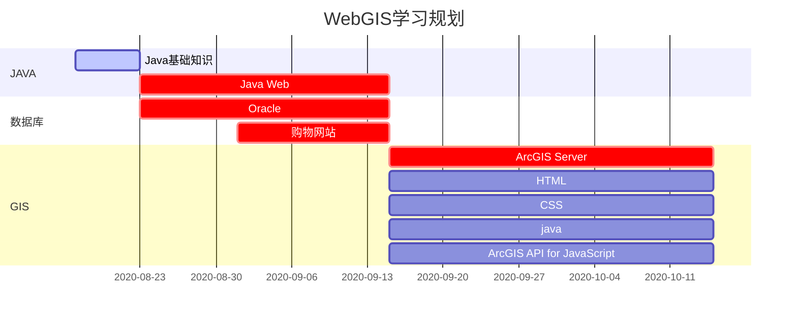

```mermaid
gantt
dateformat YYYY-MM-DD
Title WebGIS学习规划
section JAVA
Java基础知识: active,des1, 2020-08-17, 2020-08-23
Java Web: crit,des2,after des1, 23d
section 数据库
Oracle : crit,sql,after des1,23d
购物网站: crit, 2020-09-01,14d
section GIS
ArcGIS Server: crit, after sql, 30d
HTML: , after sql, 30d
CSS: , after sql, 30d
java: , after sql, 30d
ArcGIS API for JavaScript: , after sql, 30d

```

## Tools

IDEA

Navicat

