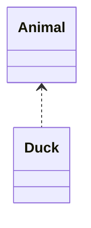
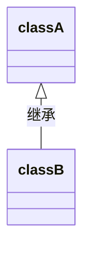
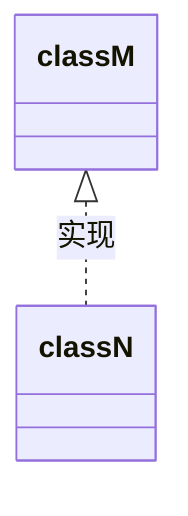
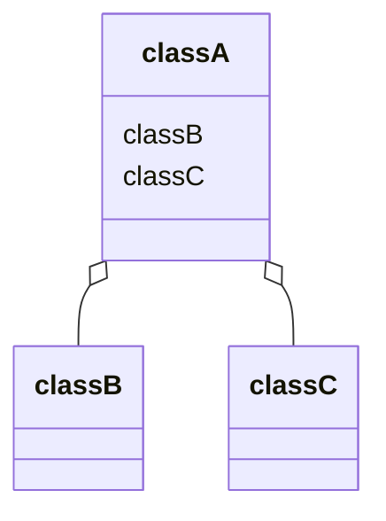
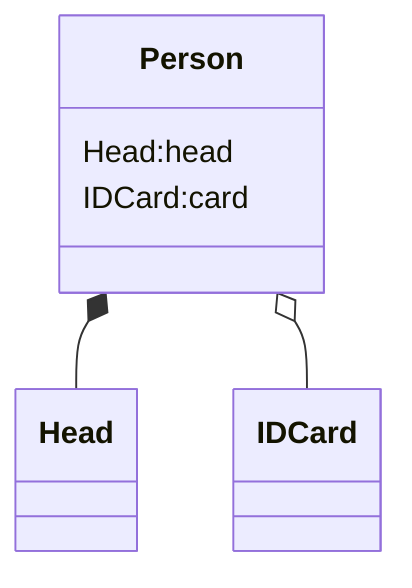

# UML类图

用于描述系统中类本身的组成和类之间的各种静态关系

- 关系：依赖、泛化（继承）、实现、关联、聚合和组合

## 依赖 Dependence

只要类中用到了对方，那么他们之间就存在依赖关系

-  类的成员属性
- 方法返回值
- 接受的参数
- 方法中使用

## 泛化 generalization

- 实际上就是继承
- 依赖关系的特例

## 实现 Implementation

- A类实现了B接口

## 关联

- 类与之间的关系，是依赖关系的特例
- 导航性：双向关系或单向关系
- 多重性：一对一，一对多，多对多

## 聚合 Aggregation

- 整体和部分的关系，部分和整体可以分开
- 导航性和多重性

## 组合 Composition

- 整体和部分的关系，整体和部分不能分开

