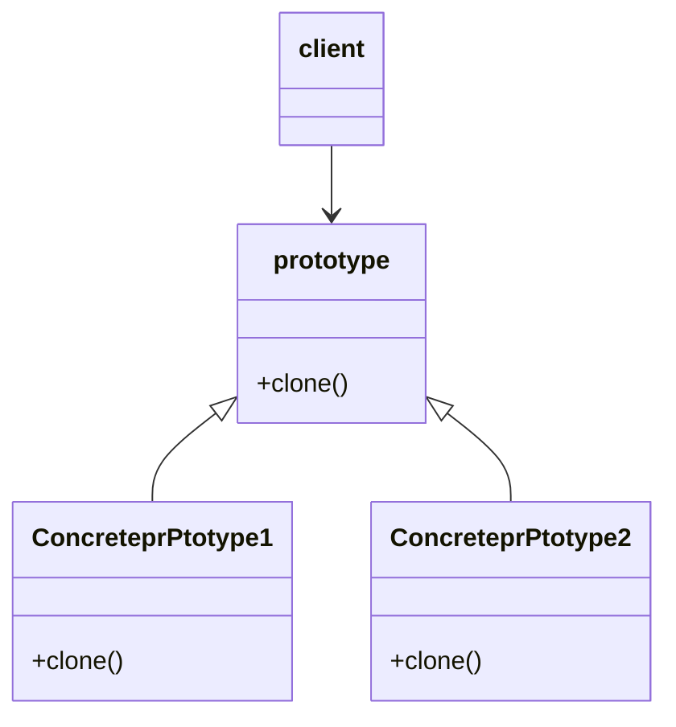

# 原型模式Prototype

- 用原型实例制定创建对象的种类，并通过拷贝这些原型，创建新的对象
- 是一种创建型设计模式，允许一个对象再创建另一个可定制的对象，无需知道如何创建的细节
- 工作原理：通过将一个圆形对象传给那个要发动创建的对象，这个要发动创建的对象通过请求原型对象拷贝他们自己来实施创建。

## 类图

## 浅拷贝和深拷贝

1. 对于数据类型是基本数据类型的成员变量，浅拷贝会直接进行值传递，也就是该属性值复制一根给新的对象
2. 对于数据类型是引用数据类型的成员变量，浅拷贝会进行引用传递，也就是只是将该成员变量的引用值（内存地址）复制一份给新的对象。因为实际上两个对象的该成员变量都指向同一个实力。在这种情况下，在一个对象中修改该成员变量会影响到另一个对象的该成员变量值
3. 默认的clone()方法实现的就是浅拷贝

## 深拷贝方法

通过对象的序列化实现

1. 创建流对象
2. 序列化
3. 反序列化

## 注意事项和细节

1. 创建新的对象比较复杂时，可以利用原型模式简化对象的创建过程，同时能够提高效率
2. 不用重新初始化对象，而是动态的获得对象运行时的状态
3. 如果原始对象发生变化，其克隆的对象也会发生相应的变化，无需修改代码
4. 在实现深克隆时需要比较复杂的代码
5. 需要为每一个类配置一个克隆方法，这对全新的类来说不难，但是对已有类需要进行改造，需要修改其源代码，违背OCP原则
