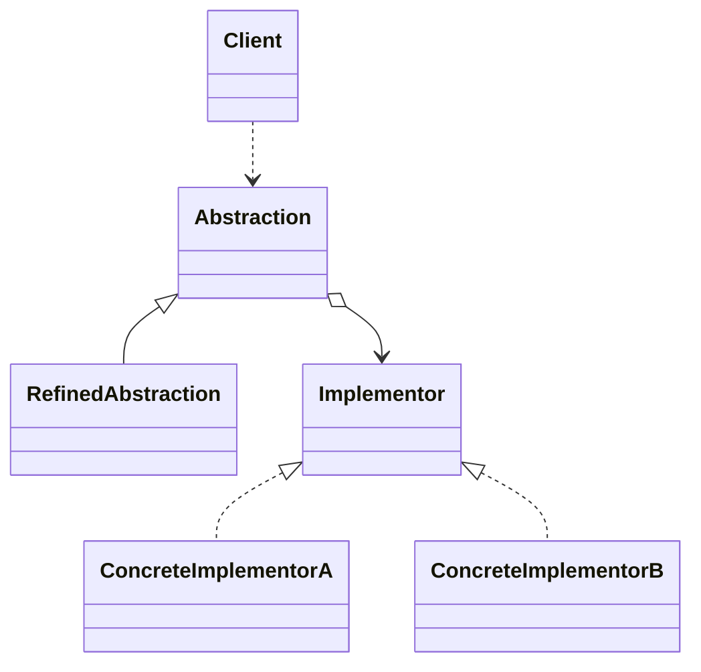

# 桥接模式

- 将实现与抽象放在两个不同的类层次中，使两个层次可以独立改变
- 结构性设计模式
- Bridge模式基于类的最小设计原则，通过使用封装、聚合及继承等行为让不同的类继承不同的职责。它的特点是把抽象与行为实现分离开来，从而可以保持各部分的独立性以及应对他们的功能扩展。

1. client类：桥接模式调用者

2. 抽象类（Abstraction）:维护了Implentor / 即它的实现类ConcreteImplementorA..二者是聚合关系Abstraction充当桥接类

3. RefinedAbstraction 是Abstraction抽象类的子类

4. Implementor:行为实现类的接口

5. ConcreteImplementorA/B：行为的具体实现类

6. 这里的抽象类和接口是聚合的关系

   

