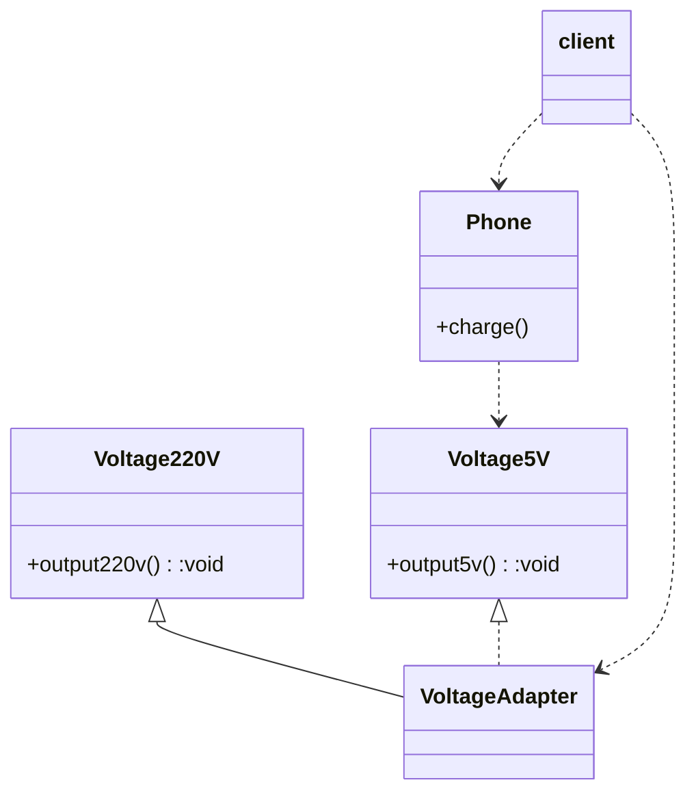
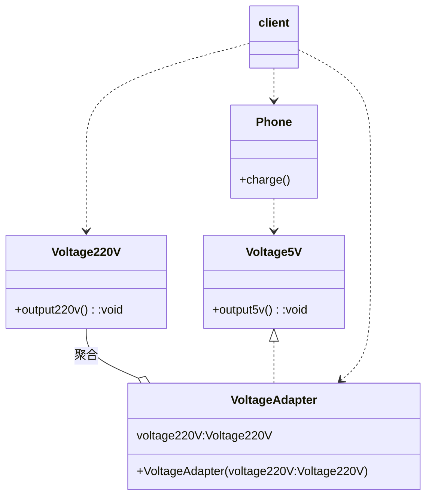
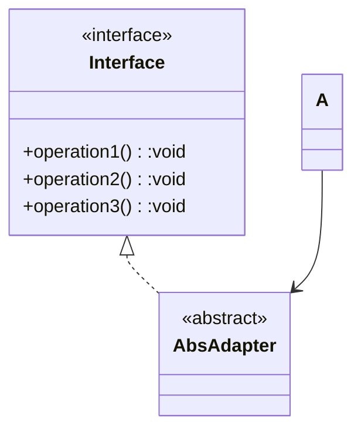

# 适配器模式（Adapter Pattern)

- 将某个类的接口转换成客户端期望的另一个接口表示，主要目的是兼容性，让原本因接口不匹配不能一起工作的两个类可以协同工作。
- 属于结构型模式
- 分三类：类适配器模式、对象适配器模式、接口适配器模式

## 类适配器

- 基本介绍：Adapter类，通过继承src类，实现dst类接口，完成src->dst的适配

### 注意事项：

- Java是单继承模式，所以类适配器需要继承Src类，因为要求dst必须是接口，有一定的局限性
- src类的方法在Adapter中都会暴露出来，也增加了使用成本
- 由于继承了src类，所以它可以根据需求重写src类的方法，使得adapter的灵活性增强了。

## 对象适配器模式

基本思路和类适配器模式一致，只是将Adapter修改，而不是集成src类，而是持有src类（即被适配者），我们的dst目标

### 注意事项：

## 接口适配器模式（缺省适配器模式）

当不需要区别实现接口提供的方法时，可以先设计一个抽象类实现接口，并为该接口中每一个方法提供一个默认实现（空方法），那么该抽象类的子类可有选择地覆盖父类的某些方法来实现需求

