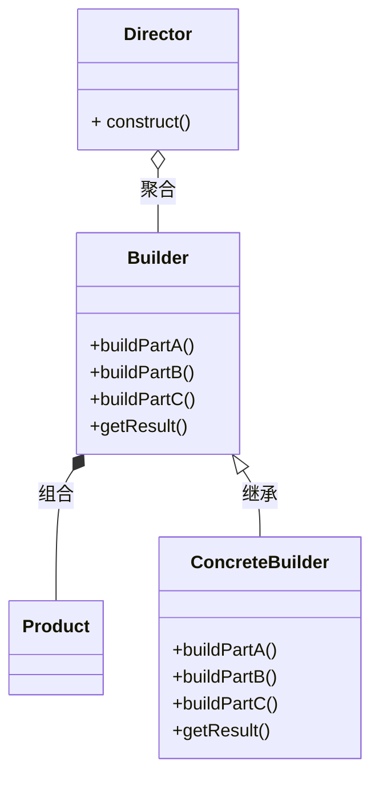

# 建造者模式 builder

- 又称生成器模式
- 将复杂对象的建造过程抽象出来（抽象类别），使这个抽象过程的不同实现方法可以构造出不同的表现（属性）对象
- 是一步步创建一个复杂的对象，它允许用户只通过指定复杂对象的类型和内容就可以构建他们，用户不需要知道内部的具体构建细节

## 四个角色

1. Product 产品角色：一个具体的产品对象
2. Builder抽象建造者：创建一个Product对象的各部件指定的接口/抽象类
3. ConcreteBuilder具体建造者：实现接口，构建和装配各部件
4. Director指挥者：构建一个使用Builder接口的对象。它主要适用于创建一个复杂的对象。
   1. 隔离了客户与对象的生产过程
   2. 负责控制产品对象的生产过程

## 类图

## 注意事项和细节

- 客户端不必知道产品内部组成的细节，将产品本身与产品的创建过程解藕，使得相同的创建过程可以创建不同的产品对象
- 每一个具体建造者都相对独立，而与其他的具体建造者无关，因此可以很快的替换或增加具体建造者，用户使用不同的具体建造者即可得到不同的产品对象
- 可以更加精细地控制产品的创建过程。
- 增加新的具体建造者无需修改原有类库的代码
- 如果产品之间差异性很大，则不适合使用建造者模式
- 抽象工厂模式实现对产品家族的创建，具有不同分类维度的产品组合，采用抽象工厂模式不需要关系构建过程，只关心什么产品由什么工厂生产即可。建造者模式则要求按照指定的蓝图建造产品，它主要的目的是通过组装零配件而产生一个新产品。

